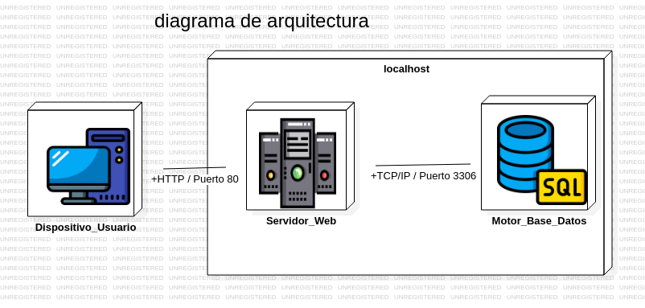
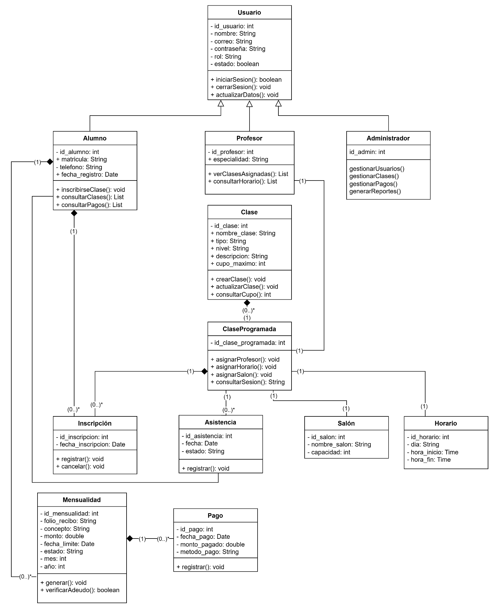
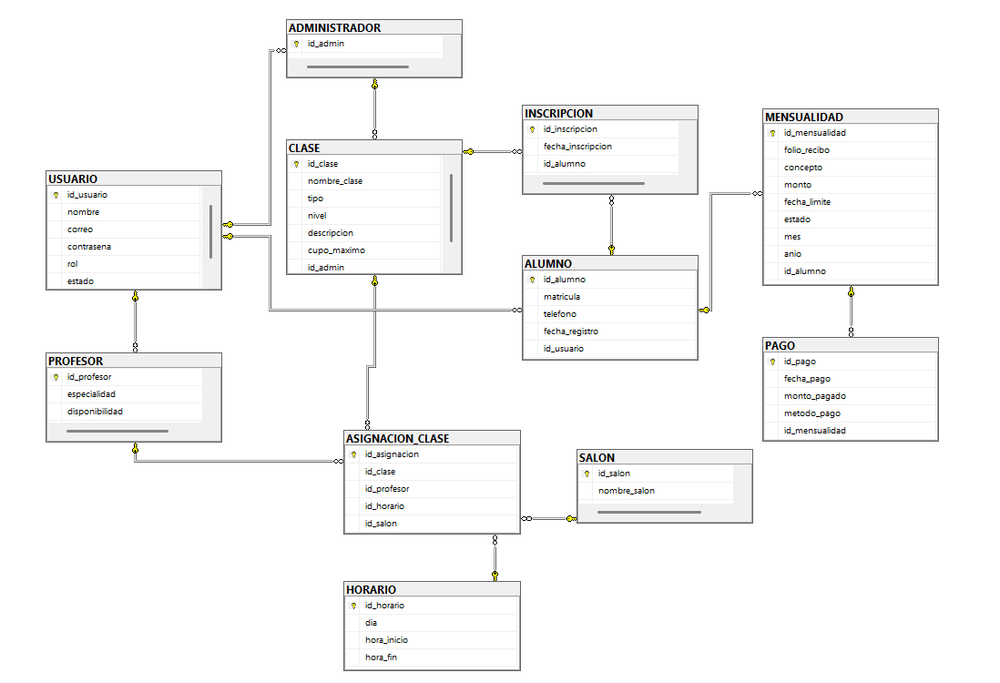
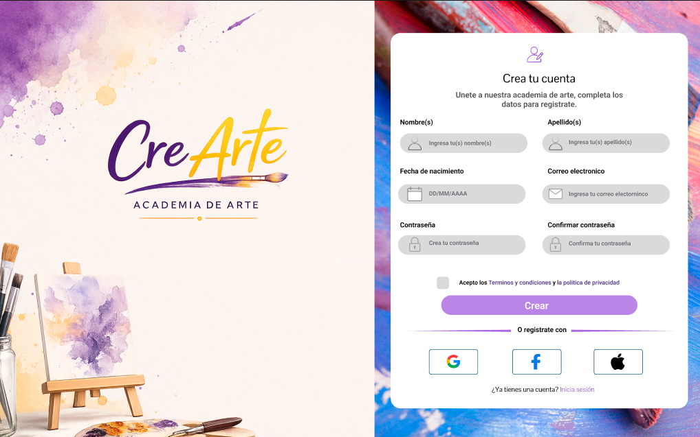
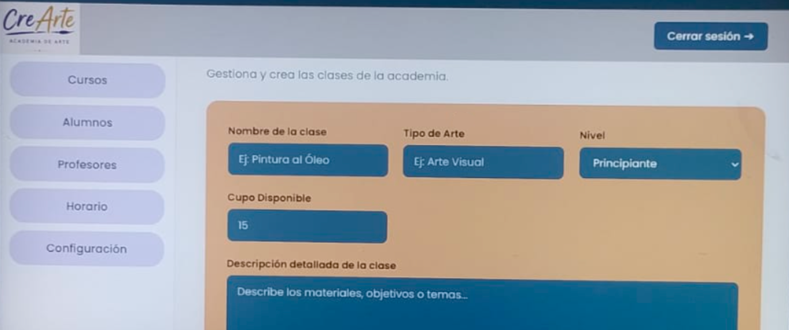
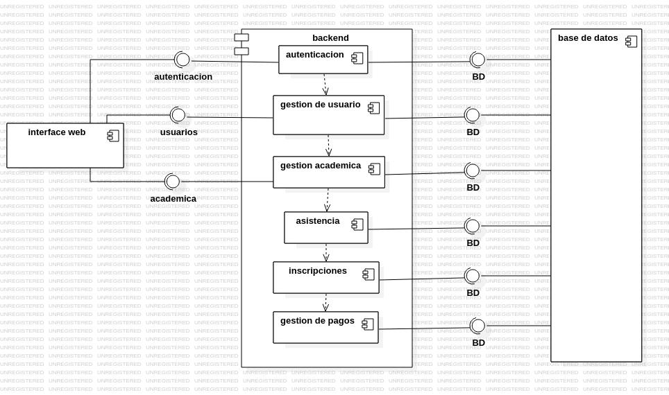

# Documentación del Sistema - CREARTE

## Información del Producto

**Nombre del producto:** CREARTE  
**Tipo de sistema:** Sistema web para la gestión académica y administrativa de una academia de artes.  
**Objetivo:** Facilitar la administración de alumnos, profesores, clases, horarios, inscripciones y pagos dentro de una academia artística.  
**Repositorio:** https://github.com/mariaosuna-fic/CreARTE  
**Sitio web:** https://cre-arte.vercel.app/  
**Backend:** https://crearte-or0f.onrender.com  

## Integrantes del Equipo

- Cázares Bonilla Diana Rosalía
- Machado Lara Maricruz
- Osuna Meraz Maíra Guadalupe
- Quintero Zazueta Marco Antonio
- Rodríguez López Carlos Alfonso

---

# 1. Introducción

CREARTE es un sistema web desarrollado para apoyar la administración académica y administrativa de una academia de artes. El proyecto surge como una solución para organizar de mejor manera la información relacionada con alumnos, profesores, clases, horarios, inscripciones y pagos.

El sistema busca reducir el uso de registros manuales, evitar errores en la administración de datos y permitir que la información pueda consultarse de forma más rápida, clara y ordenada desde una plataforma web.

---

# 2. Resumen del Sistema

CREARTE permite gestionar la información principal de una academia artística mediante una aplicación web conectada a una base de datos MySQL. El sistema cuenta con una interfaz visual para los usuarios y un backend encargado de procesar las solicitudes, conectarse con la base de datos y responder a las operaciones realizadas desde el frontend.

Entre sus funciones principales se encuentran el registro de usuarios, inicio de sesión, administración de clases, consulta de cursos y manejo de información académica relacionada con alumnos, profesores y pagos.

El proyecto está diseñado bajo una arquitectura cliente-servidor, donde el frontend se encarga de la interacción con el usuario y el backend procesa la lógica del sistema mediante rutas y servicios conectados a la base de datos.

---

# 3. Requisitos

## 3.1. Requisitos Funcionales

| Requisito | Descripción |
|---|---|
| Registro de usuarios | El sistema debe permitir registrar usuarios con información básica como nombre, correo, contraseña y rol. |
| Inicio de sesión | El sistema debe permitir que los usuarios accedan mediante correo electrónico y contraseña. |
| Gestión de roles | El sistema debe diferenciar el acceso según el tipo de usuario: administrador, alumno o profesor. |
| Gestión de clases | El administrador debe poder registrar, consultar, editar y eliminar clases. |
| Consulta de cursos | Los usuarios deben poder visualizar información sobre los cursos disponibles. |
| Gestión de alumnos | El sistema debe permitir almacenar información relacionada con los alumnos. |
| Gestión de profesores | El sistema debe permitir registrar información de profesores y su especialidad. |
| Gestión de horarios | El sistema debe organizar los horarios relacionados con las clases. |
| Gestión de pagos | El sistema debe permitir registrar y consultar información relacionada con mensualidades y pagos. |
| Navegación del sitio | El sistema debe contar con páginas principales como inicio, nosotros, cursos, contacto, login y registro. |
| Conexión con base de datos | El sistema debe guardar y consultar la información desde una base de datos MySQL. |

## 3.2. Requisitos No Funcionales

| Requisito | Descripción |
|---|---|
| Seguridad | El sistema debe proteger el acceso mediante autenticación de usuarios y separación de roles. |
| Disponibilidad | El sistema debe estar disponible desde un navegador web con conexión a internet. |
| Usabilidad | La interfaz debe ser clara, sencilla y fácil de utilizar. |
| Rendimiento | Las consultas y operaciones deben ejecutarse de forma eficiente. |
| Escalabilidad | El sistema debe permitir agregar nuevos módulos en el futuro. |
| Mantenimiento | El código debe estar organizado para facilitar correcciones y mejoras. |
| Compatibilidad | El sistema debe funcionar en navegadores modernos. |
| Integridad de datos | La información almacenada debe mantenerse correcta y relacionada entre tablas. |
| Accesibilidad | El sistema debe ser fácil de navegar para usuarios con diferentes niveles de conocimiento tecnológico. |

## 3.3. Requisitos Técnicos

| Tecnología | Uso en el proyecto |
|---|---|
| HTML5 | Estructura de las páginas web. |
| CSS3 | Diseño visual y estilos del sistema. |
| JavaScript | Interactividad del frontend y consumo de rutas del backend. |
| Node.js | Entorno de ejecución para el backend. |
| Express.js | Creación del servidor y manejo de rutas. |
| MySQL | Base de datos relacional del sistema. |
| MySQL Workbench | Administración y visualización de la base de datos. |
| Git | Control de versiones del proyecto. |
| GitHub | Almacenamiento remoto del repositorio. |
| Vercel | Despliegue del frontend del sistema. |
| Render | Despliegue del backend en servidor remoto. |
| Visual Studio Code | Editor de código utilizado para el desarrollo. |
| Postman | Prueba de rutas y endpoints del backend. |

## 3.4. Requisitos de Arquitectura del Sistema

| Requisito | Descripción |
|---|---|
| Arquitectura cliente-servidor | El sistema se divide en frontend, backend y base de datos. |
| Separación de responsabilidades | El frontend muestra la interfaz, el backend procesa la lógica y la base de datos almacena la información. |
| Comunicación mediante API | El frontend consume rutas del backend para registrar, consultar, actualizar y eliminar información. |
| Base de datos relacional | La información se organiza en tablas relacionadas dentro de MySQL. |
| Despliegue web | El frontend se encuentra publicado en Vercel y el backend en Render. |

---

# 4. Diseño del Sistema

El diseño visual y la estructura de navegación de CREARTE fueron planificados utilizando Figma. Esta etapa permitió organizar la experiencia de usuario, distribución de componentes y estructura general de las interfaces antes del desarrollo del sistema.

## 4.1. Prototipo en Figma

El diseño de la interfaz principal del sistema CREARTE fue elaborado en Figma. Este diseño sirvió como base para definir la distribución visual de la página principal, navegación, colores, secciones informativas, formularios de acceso y estructura general del sistema.

[Visualizar diseño del sistema en Figma](https://www.figma.com/design/atf5AqkZQobQgbbRzdr7iz/UI-CreARTE?node-id=62-2&t=BqakkoqnlPaoXhTV-1)

## 4.2. Vista previa del diseño


---

# 5. Arquitectura del Sistema

El sistema CREARTE utiliza una arquitectura web cliente-servidor dividida en tres capas principales:

```text
Usuario
↓
Frontend
↓
Backend / API
↓
Base de Datos MySQL
```

## 5.1. Diagrama de arquitectura



## 5.2. Capas del sistema

| Capa | Descripción |
|---|---|
| Frontend | Es la parte visual del sistema. Permite al usuario interactuar con las páginas, formularios, botones y secciones del sitio. |
| Backend | Procesa las solicitudes del frontend, maneja la lógica del sistema y se comunica con la base de datos. |
| Base de Datos | Almacena la información de usuarios, alumnos, profesores, clases, horarios, pagos e inscripciones. |

## 5.3. Funcionamiento general

```text
1. El usuario interactúa con la interfaz web.
2. El frontend envía solicitudes al backend.
3. El backend procesa la solicitud mediante rutas creadas con Express.js.
4. El backend consulta o modifica la información en MySQL.
5. La base de datos devuelve la información solicitada.
6. El backend responde al frontend.
7. El frontend muestra el resultado al usuario.
```

## 5.4. Diagrama de clases

El siguiente diagrama representa la estructura lógica y las relaciones principales entre las entidades del sistema CREARTE.



---

# 6. Instalación y Ejecución

El sistema CREARTE puede utilizarse de dos formas: mediante la versión desplegada en internet o ejecutando el proyecto de manera local para desarrollo.

## 6.1. Opción 1: Uso del sistema desplegado

La forma más sencilla de revisar el sistema es mediante los enlaces desplegados.

**Frontend del sistema:**  
https://cre-arte.vercel.app/

**Backend del sistema:**  
https://crearte-or0f.onrender.com

En esta modalidad no es necesario instalar dependencias ni configurar la base de datos localmente, ya que el frontend se encuentra publicado en Vercel y el backend se encuentra desplegado en Render.

El frontend corresponde a la parte visual del sistema, es decir, las páginas HTML, estilos CSS y archivos JavaScript que utiliza el usuario. El backend corresponde al servidor creado con Node.js y Express, encargado de procesar solicitudes, validar información y comunicarse con la base de datos MySQL.

## 6.2. Opción 2: Ejecución local del proyecto

Para ejecutar el proyecto de forma local, se deben seguir los siguientes pasos.

### 6.2.1. Clonar el repositorio

```bash
git clone https://github.com/mariaosuna-fic/CreARTE.git
```

### 6.2.2. Entrar a la carpeta del proyecto

```bash
cd CreARTE
```

### 6.2.3. Entrar a la carpeta del backend

```bash
cd backend
```

### 6.2.4. Instalar dependencias

```bash
npm install
```

### 6.2.5. Configurar variables de entorno

Crear un archivo llamado `.env` dentro de la carpeta `backend`. Este archivo debe contener la configuración necesaria para conectar el servidor con la base de datos MySQL.

Ejemplo de estructura del archivo `.env`:

```env
DB_HOST=
DB_USER=
DB_PASSWORD=
DB_NAME=CREARTE
DB_PORT=
JWT_SECRET=
PORT=3000
```

Las credenciales reales de conexión no se colocan directamente en el repositorio público por seguridad.

### 6.2.6. Ejecutar el servidor en desarrollo

```bash
node server.js
```

También puede ejecutarse con nodemon:

```bash
npx nodemon server.js
```

### 6.2.7. Abrir la aplicación

Una vez iniciado el servidor local, se puede acceder desde el navegador mediante la ruta configurada para el proyecto.

```text
http://localhost:3000
```

### 6.2.8. Servidor remoto

El backend desplegado en Render puede consultarse mediante la siguiente dirección:

```text
https://crearte-or0f.onrender.com
```

---

# 7. Uso del Sistema

Esta sección describe la forma en que el usuario puede ingresar y utilizar las funciones principales del sistema CREARTE.

## 7.1. Acceso a la página principal

El usuario debe ingresar al sitio web del sistema:

```text
https://cre-arte.vercel.app/
```

La página principal funciona como la primera vista del sistema CREARTE. Desde esta sección, los usuarios pueden conocer información general sobre la academia, sus cursos y las opciones principales de navegación.
 

## 7.2. Registro de usuario

Para crear una cuenta nueva, el usuario debe:

1. Entrar a la sección de registro.
2. Capturar los datos solicitados en el formulario.
3. Ingresar nombre, correo electrónico, contraseña y rol correspondiente.
4. Enviar el formulario.
5. Esperar la confirmación del sistema.

La información registrada se envía al backend y se almacena en la base de datos MySQL.

## 7.3. Inicio de sesión

Para ingresar al sistema, el usuario debe:

1. Entrar a la sección de inicio de sesión.
2. Capturar su correo electrónico.
3. Capturar su contraseña.
4. Presionar el botón de inicio de sesión.
5. Esperar la validación de datos.

Si los datos son correctos, el sistema permite el acceso de acuerdo con el rol del usuario.

## Credenciales de administrador (prueba)

Para acceder al panel administrativo del sistema, se puede utilizar el siguiente usuario de prueba:

```text
Correo: carlos1@gmail.com
Contraseña: carlos1

## 7.4. Módulo CRUD seleccionado: Clases
``` 

Para cumplir con el requerimiento de creación, lectura, actualización y eliminación de registros, se seleccionó la entidad **Clase**.

Este módulo permite administrar las clases disponibles dentro de la academia CREARTE.

### Campos del formulario de clases

- Nombre de la clase.
- Tipo de clase.
- Nivel.
- Descripción.
- Cupo máximo.

### Operaciones disponibles

| Operación | Descripción |
|---|---|
| Crear | Permite registrar una nueva clase en el sistema. |
| Leer | Permite consultar las clases registradas. |
| Actualizar | Permite modificar la información de una clase existente. |
| Eliminar | Permite borrar una clase registrada. |

### Pasos para utilizar el formulario de clases

1. Ingresar al sistema.
2. Acceder al módulo de clases.
3. Capturar los datos de la clase en el formulario.
4. Presionar el botón para guardar la clase.
5. Verificar que la clase aparezca en el listado.
6. Para editar, seleccionar la clase registrada y modificar sus datos.
7. Para eliminar, seleccionar la opción correspondiente y confirmar la eliminación.

## 7.5. Consulta de cursos

Los usuarios pueden visualizar los cursos disponibles de la academia, como:

- Pintura.
- Teatro.
- Danza.
- Escultura.

## 7.6. Gestión administrativa

El sistema está pensado para facilitar el control de información académica y administrativa, permitiendo que los datos se almacenen de forma organizada en la base de datos.

---

# 8. Base de Datos (Modelado)

La base de datos del sistema se llama:

```text
CREARTE
```

CREARTE utiliza una base de datos relacional en MySQL para almacenar la información del sistema. Esta base de datos contiene tablas relacionadas entre sí para organizar usuarios, alumnos, profesores, clases, horarios, salones, inscripciones, asistencias, mensualidades y pagos.

## 8.1. Modelado de la base de datos

La base de datos del sistema CREARTE fue modelada bajo un esquema relacional utilizando MySQL. El modelo permite organizar la información principal del sistema mediante tablas conectadas por claves primarias y claves foráneas.

El diseño contempla las entidades necesarias para administrar usuarios, alumnos, profesores, administradores, clases, horarios, salones, inscripciones, asistencias, mensualidades y pagos.

## 8.2. Despliegue y conexión de la base de datos

El sistema utiliza una base de datos MySQL conectada al backend mediante variables de entorno. Esto permite proteger las credenciales de acceso y evitar que los datos sensibles se publiquen directamente en el repositorio.

La estructura general de despliegue es la siguiente:

```text
Frontend: Vercel
Backend/API: Render
Base de datos: MySQL
Repositorio: GitHub
```

El frontend consume las rutas del backend desplegado en Render. El backend se encarga de conectarse con la base de datos MySQL para realizar consultas, registros, actualizaciones y eliminaciones.

## 8.3. Script de base de datos

El script utilizado para crear o consultar la estructura de la base de datos se encuentra dentro del repositorio del proyecto.

```text
backend/database/script_datos.sql
```

Este archivo contiene la estructura necesaria para la creación de tablas y relaciones principales del sistema.

## 8.4. Diagrama entidad-relación

El siguiente diagrama muestra la estructura de la base de datos y las relaciones entre las tablas del sistema.



## 8.5. Tablas principales

| Tabla | Descripción |
|---|---|
| Usuario | Almacena la información general de los usuarios del sistema. |
| Alumno | Guarda los datos específicos de los alumnos. |
| Profesor | Guarda los datos específicos de los profesores. |
| Administrador | Guarda la información relacionada con usuarios administradores. |
| Clase | Almacena la información de las clases disponibles. |
| Horario | Guarda los días y horas en que se imparten las clases. |
| Salon | Almacena los salones o espacios disponibles para las clases. |
| Clase_Programada | Relaciona clases, profesores, horarios y salones. |
| Inscripcion | Registra la inscripción de alumnos a clases programadas. |
| Asistencia | Controla la asistencia de los alumnos a las clases. |
| Mensualidad | Almacena la información de pagos pendientes o realizados por mes. |
| Pago | Registra los pagos realizados por los alumnos. |

## 8.6. Relaciones principales

- Un usuario puede estar asociado a un alumno, profesor o administrador.
- Un profesor puede impartir una o varias clases.
- Una clase puede tener horarios y salones asignados.
- Un alumno puede inscribirse a una o varias clases programadas.
- Una mensualidad pertenece a un alumno.
- Un pago pertenece a una mensualidad.
- La asistencia se registra por alumno y clase programada.

## 8.7. Objetivo de la base de datos

La base de datos permite mantener organizada la información del sistema y facilita operaciones como:

- Consultar usuarios.
- Registrar alumnos y profesores.
- Administrar clases.
- Controlar inscripciones.
- Revisar pagos y mensualidades.
- Consultar horarios y salones.
- Mantener la información relacionada de forma estructurada.

## 8.8. Seguridad en la base de datos

Para proteger la información almacenada, el sistema considera las siguientes medidas:

- Uso de claves primarias para identificar registros.
- Uso de claves foráneas para mantener relaciones correctas entre tablas.
- Restricciones de datos para evitar información inválida.
- Separación de roles de usuario.
- Manejo de credenciales mediante variables de entorno.
- Evitar exponer datos sensibles directamente en el código público.
- Validación de datos antes de enviarlos a la base de datos.

---

# 9. Evidencia Visual del Sistema

En esta sección se muestran capturas de pantalla relacionadas con el funcionamiento del sistema.

## 9.1. Página principal


## 9.2. Login


## 9.3. Registro



## 9.4. CRUD de clases



## 9.5. Base de datos



---

# 10. Conclusión

CREARTE es un sistema web diseñado para apoyar la administración académica y administrativa de una academia de artes. El proyecto integra una interfaz principal, registro e inicio de sesión de usuarios, módulo CRUD para la entidad Clase, conexión con base de datos MySQL y documentación técnica para su instalación, ejecución y uso.

El sistema cumple con los requerimientos solicitados, ya que incluye código del proyecto, documentación del sistema, información del producto, integrantes del equipo, requisitos, arquitectura, instalación, uso y modelado de base de datos.